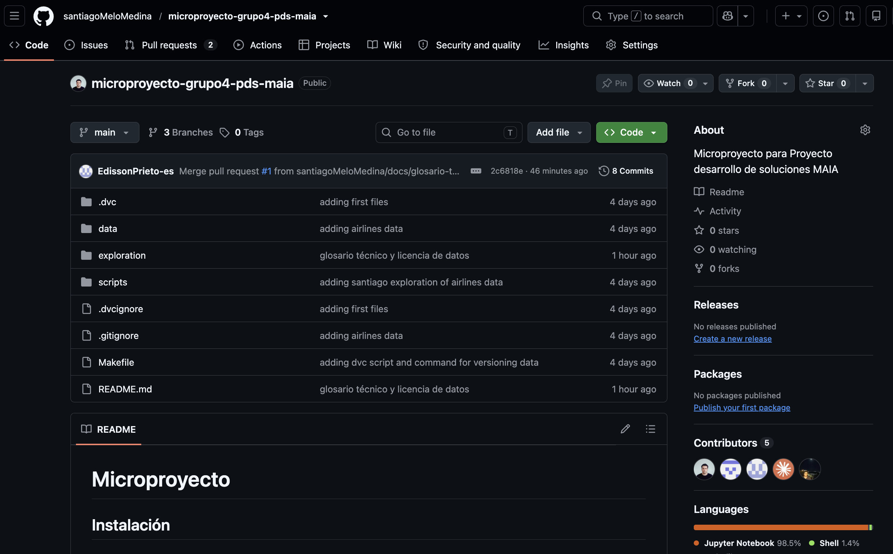
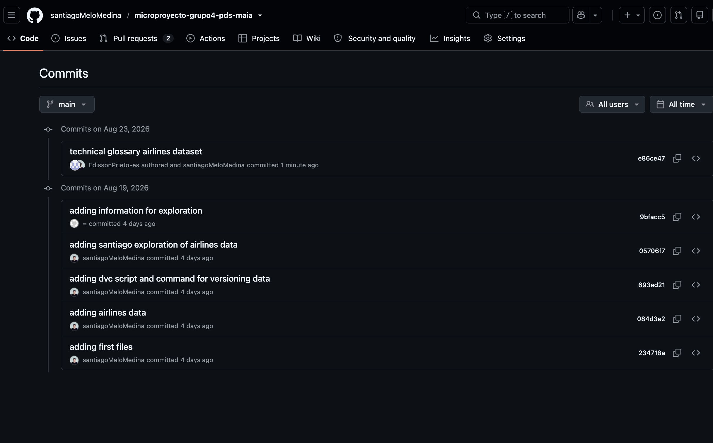
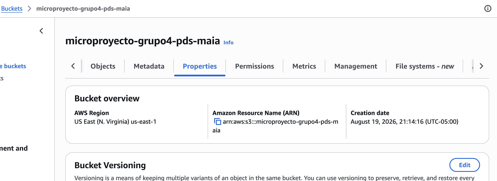
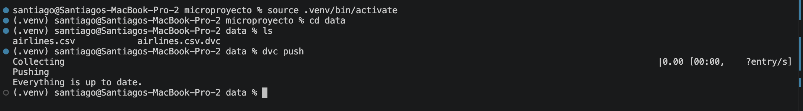
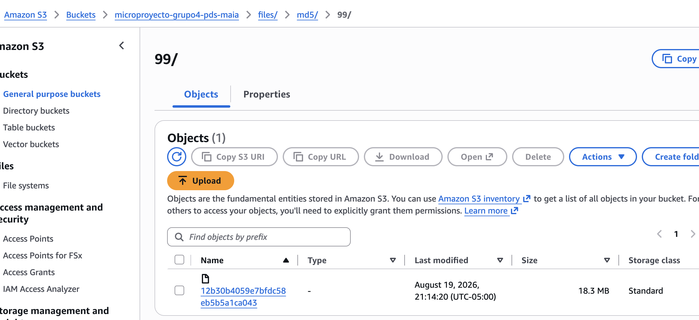

## 6. Repositorios creados

### 6.1 Repositorio GitHub

URL: https://github.com/santiagoMeloMedina/microproyecto-grupo4-pds-maia




### 6.2 Bucket / almacenamiento remoto (S3)

Bucket: `s3://microproyecto-grupo4-pds-maia`
Región: **us-east-1**

Credenciales de AWS Academy Learner Lab compartidas (*872896465993*) en el equipo.



### 6.3 Configuración DVC

Comando de inicialización:
```bash
dvc init
```

Comando para versionar el dataset:
```bash
dvc add data/airlines.csv
```

Contenido de `data/airlines.csv.dvc`:
```yaml
outs:
- md5: 9912b30b4059e7bfdc58eb5b5a1ca043
  size: 19164425
  hash: md5
  path: airlines.csv
```

Comando para configurar el remote:
```bash
dvc remote add -d aws-remote s3://microproyecto-grupo4-pds-maia
```

Contenido de `.dvc/config`:
```ini
[core]
    remote = aws-remote
['remote "aws-remote"']
    url = s3://microproyecto-grupo4-pds-maia
```




