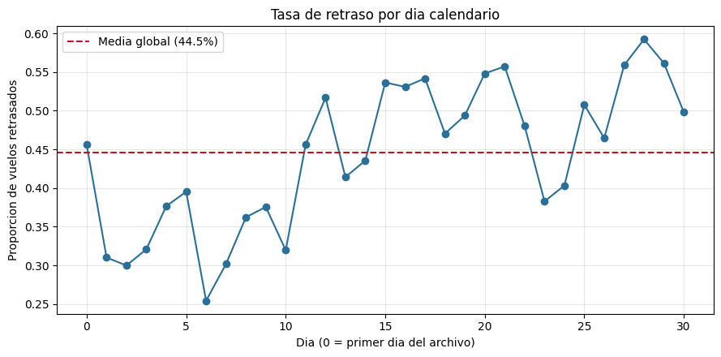
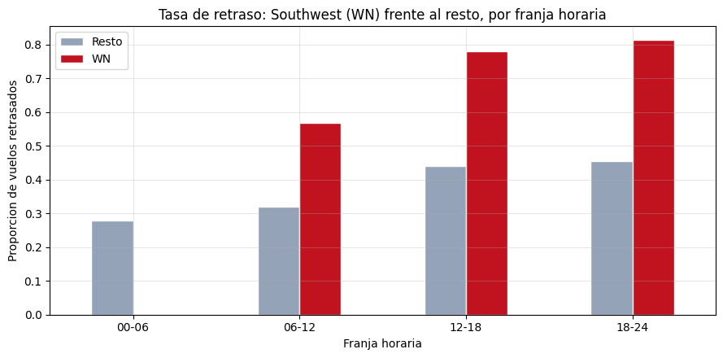
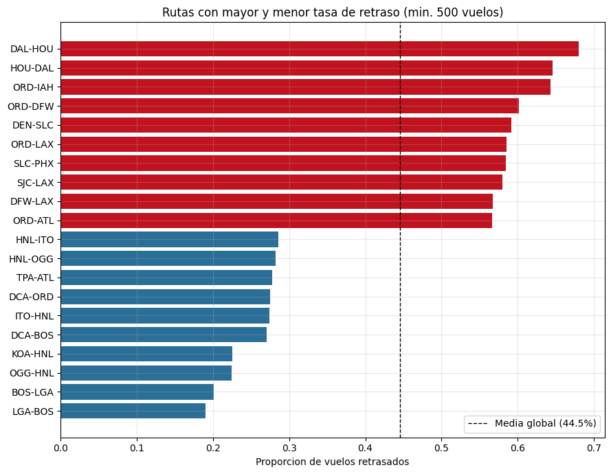

# Borrador — Hallazgos posteriores a la Entrega 1

**Micro-proyecto · Proyecto de Desarrollo de Soluciones · MAIA**

> **Qué es este documento.** Un análisis exploratorio posterior, su propósito es servir de insumo para la Entrega 2, porque **tres de sus
> hallazgos cambian decisiones de modelado**.
>
> Notebook reproducible: [`exploration/katherin-airlines.ipynb`](../../exploration/katherin-airlines.ipynb).

---

## 1. Resumen: qué cambia respecto a la Entrega 1

| Sección de la Entrega 1 | Lo que dice | Lo que muestran los datos |
|---|---|---|
| §4.5 Balance y particiones | "dado que no hay fechas, no se puede hacer un split temporal estricto. Se debe hacer un split estratificado por `Delay`" | **Sí se puede.** Las filas están en orden cronológico y permiten reconstruir 31 días consecutivos. El split estratificado aleatorio es además contraproducente. |
| §2.3 y §4.2 Cobertura temporal | "el dataset no incluye fecha explícita, solo `DayOfWeek`; no es posible ubicar los vuelos en un rango de fechas calendario" | Correcto que no hay fecha calendario, pero **sí hay orden temporal recuperable**: 31 días seguidos empezando un miércoles. |
| §4.4 punto 1, duplicados | "podrían representar vuelos recurrentes y no un error de carga" | **Confirmado con evidencia.** El 51,4% de los itinerarios repetidos aparece con `Delay` contradictorio. |
| §3.1 Variable objetivo | Balance global 55,46% / 44,54% | Es correcto, pero es el promedio de dos regímenes: 34,5% de retrasos en la primera semana y 51,6% en la última. |
| §4.4 "se trabajará con todas las variables numéricas" | — | `Flight` es un identificador. Su correlación de -0,34 con `Length` es un artefacto de numeración, no una señal. |

Además, un hallazgo de calidad que no se había detectado: **el CSV arrastra un espacio inicial en
`AirportFrom` y `AirportTo` en las 539.383 filas.**

---

## 2. Hallazgos

### 2.1 Calidad: espacio inicial en los campos de texto

El CSV proviene de la sección `@data` de un archivo ARFF y conserva un espacio después de cada
coma. Al leerlo con `pd.read_csv` sin parámetros, los valores quedan como `' SFO'` en vez de
`'SFO'`, en el 100% de las filas.

No altera la cardinalidad (293 aeropuertos en ambos casos) ni invalida ningún conteo de la Entrega
1. Pero rompería cualquier cruce con un catálogo externo de aeropuertos y ensucia las categorías
que se van a codificar en *one-hot*.

**Acción:** leer siempre con `skipinitialspace=True`.

### 2.2 Los duplicados no son un error de carga

La Entrega 1 dejó los 216.618 duplicados sin eliminar, con la hipótesis correcta pero sin
verificarla. La prueba: separar la **clave de itinerario** (`Airline`, `Flight`, `AirportFrom`,
`AirportTo`, `DayOfWeek`, `Time`, `Length`) de la variable objetivo.

| | |
|---|---|
| Claves de itinerario distintas | 227.392 |
| Claves que aparecen más de una vez | 185.451 |
| De esas, con `Delay` contradictorio | 95.373 (**51,4%**) |

Una duplicación accidental produce copias idénticas, nunca resultados opuestos para el mismo vuelo.
Los registros repetidos son **ocurrencias distintas del mismo vuelo programado**.

**Acción:** conservarlos, ahora con justificación documentada.

### 2.3 El dataset sí tiene orden temporal

`DayOfWeek` no se alterna al azar: forma **31 bloques consecutivos** que recorren la semana en
orden (3, 4, 5, 6, 7, 1, 2, 3, …), y dentro de cada bloque `Time` es monótonamente creciente.

El archivo son 31 días calendario seguidos, empezando un miércoles, con una media de 17.400 vuelos
por día. El índice de la fila es una variable temporal utilizable, y permite reconstruir el día
relativo que el dataset no traía.

Esto también explica los duplicados de §2.2: un vuelo semanal aparece hasta cuatro o cinco veces
con el mismo itinerario y distinto resultado.

> Nota: esto no contradice que falte la fecha calendario. El año sigue sin ser verificable a partir
> de los datos; lo que sí se recupera es el **orden y la separación en días**.

### 2.4 La tasa de retraso se desplaza a lo largo del mes

*Figura 1. Tasa de retraso por día calendario. La línea roja marca la media global.*

La tasa pasa de **34,5% en la primera semana a 51,6% en la última**, con días extremos de 25,4% y
59,2%. La deriva es mucho mayor que cualquier efecto medido en la Entrega 1: `DayOfWeek` mueve la
tasa apenas entre 40,1% y 47,1%.

Esto es coherente con que OpenML etiquete el dataset como caso de **`concept_drift`**.

### 2.5 Consecuencia: la partición no puede ser aleatoria

Este es el punto que corrige directamente §4.5 de la Entrega 1.

Con partición temporal (días 0–24 entrenamiento, 431.918 filas; días 25–30 prueba, 107.465 filas):

| | Tasa de retraso |
|---|---|
| Entrenamiento (días 0–24) | 42,41% |
| Prueba (días 25–30) | 53,14% |

La clase mayoritaria del entrenamiento **ni siquiera es la clase mayoritaria de la prueba**. Un
clasificador que siempre prediga la clase mayoritaria aprendida obtiene **46,9%**, por debajo del
azar.

Un split estratificado aleatorio reparte los mismos días entre entrenamiento y prueba, lo que
oculta este comportamiento por completo y produce métricas optimistas. La Entrega 1 se propone en
§2.3 punto 5 "evitar la fuga de información entre particiones"; el split estratificado es
precisamente la vía por la que esa fuga entraría.

**Acción:** partición temporal. Estratificar por `Delay` solo tendría sentido dentro de cada
bloque temporal, nunca sobre el dataset completo.

### 2.6 Líneas base que el modelo debe superar

| Línea base | Accuracy en prueba |
|---|---|
| Siempre la clase mayoritaria del entrenamiento | 46,9% |
| Memorizar el resultado histórico del itinerario | 55,4% |
| Tasa histórica por aerolínea × franja horaria | **59,8%** |

El umbral real a superar es **59,8%**, no el 55,5% que sugeriría el balance global de clases.
Conviene reportar estas tres referencias junto a los resultados de Regresión Logística, Random
Forest y XGBoost en la Entrega 2, para poder afirmar que el modelo aporta algo por encima de una
regla simple.

### 2.7 La aerolínea no es un sustituto de la hora

*Figura 2. Tasa de retraso de WN frente al resto de aerolíneas, por franja horaria.*

`WN` (Southwest) tiene 69,8% de retrasos y `Time` correlaciona positivamente con `Delay`, lo que
sugería que WN se viera penalizada por programar más tarde. **No es el caso:**

- La correlación entre la tasa de retraso de una aerolínea y su hora media de salida es **-0,18**,
  negativa. Las dos aerolíneas de horario más tardío (`FL` y `YV`) están entre las de menor tasa.
- La hora media de WN (802 minutos) es prácticamente la media del dataset (803).

| Franja | Resto | WN |
|---|---|---|
| 00–06 | 27,9% | (no opera) |
| 06–12 | 31,9% | 56,7% |
| 12–18 | 44,1% | 78,0% |
| 18–24 | 45,3% | 81,3% |

**Acción:** `Airline` y `Time` aportan información distinta; ambas entran al modelo.

### 2.8 Rutas

*Figura 3. Rutas frecuentes (mínimo 500 vuelos) con mayor y menor tasa de retraso.*

De las 4.190 rutas del dataset, las 99 con al menos 500 vuelos abarcan un rango de **19,0% a
68,0%**, más discriminante que los aeropuertos por separado.

Las dos peores, `DAL–HOU` (68,0%) y `HOU–DAL` (64,6%), son **100% Southwest**: su puente aéreo
entre Dallas Love Field y Houston Hobby. El efecto de ruta y el de aerolínea se solapan en los
extremos.

**Acción:** la característica derivada de ruta que menciona §2.3 punto 3 es prometedora, pero debe
evaluarse su aporte incremental sobre `Airline` para no introducir colinealidad.

---

## 3. Propuesta para la Entrega 2

**Preparación**

1. Leer con `skipinitialspace=True`.
2. Eliminar los 4 registros con `Length = 0`.
3. Conservar los duplicados.
4. Derivar el día relativo (0–30) a partir del orden de las filas y añadirlo como columna.
5. Derivar la franja horaria y la ruta origen–destino.
6. Tratar `Flight` como categórica de alta cardinalidad o excluirla; no usarla como numérica.

**Validación**

7. Partición temporal: días 0–24 entrenamiento, 25–30 prueba. Para validación, cortes temporales
   sucesivos dentro del tramo de entrenamiento en lugar de *k-fold* aleatorio.
8. Reportar las tres líneas base de §2.6 junto a cada modelo.
9. Dado que la tasa base se desplaza, revisar la calibración de probabilidades sobre el tramo de
   prueba y no solo sobre el de entrenamiento — relevante porque el prototipo muestra probabilidad
   y nivel de riesgo, no solo la clase.

**Producto**

10. Considerar un indicador en el tablero con la ventana temporal usada para entrenar, y contemplar
    el reentrenamiento periódico como parte del diseño: la deriva de §2.4 es evidencia directa de
    que un modelo entrenado una vez pierde vigencia.

---
