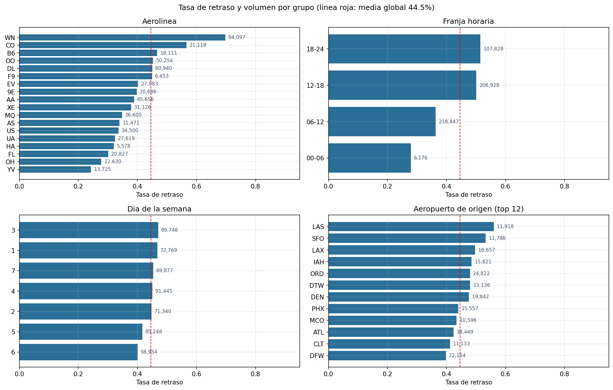
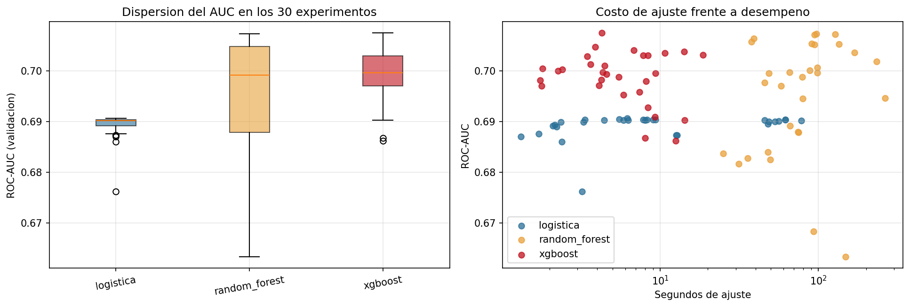
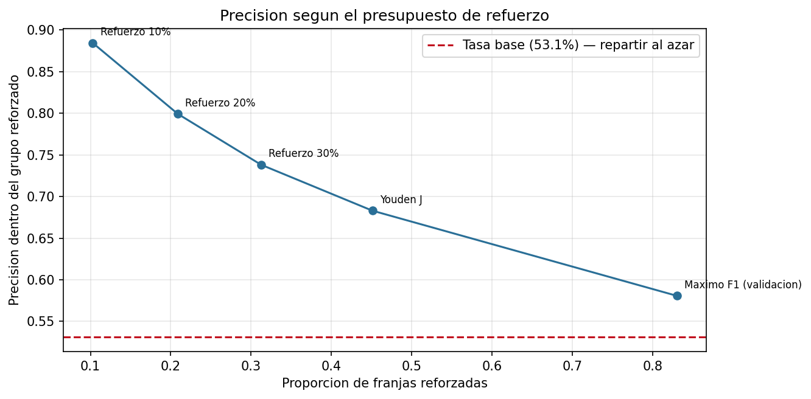
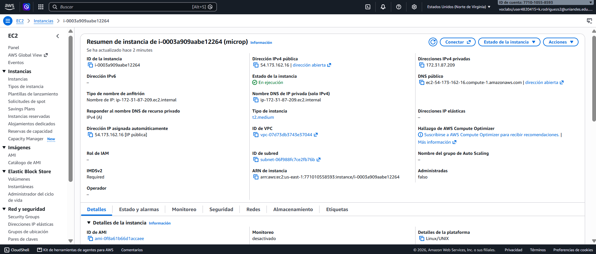
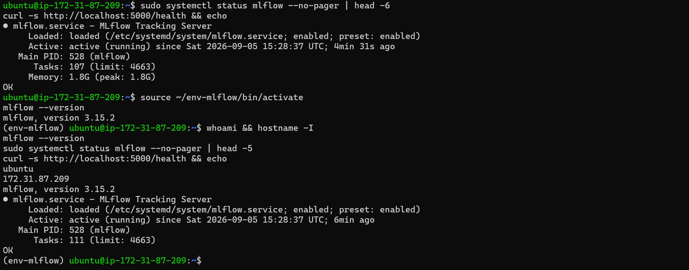
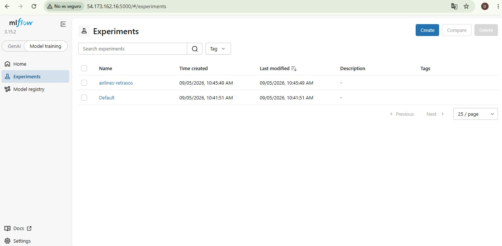
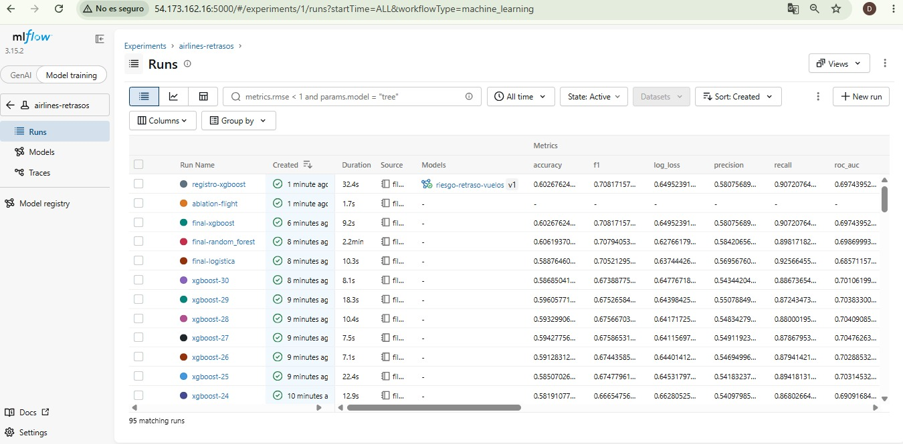
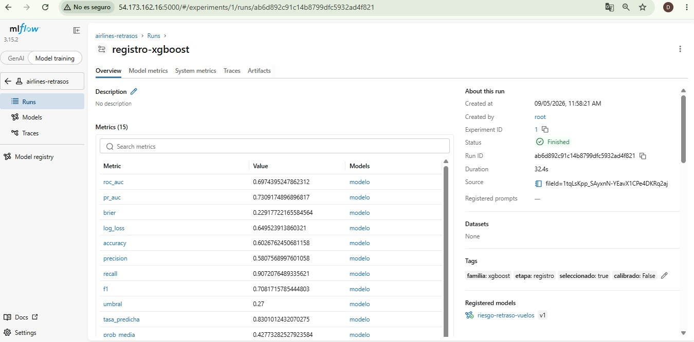
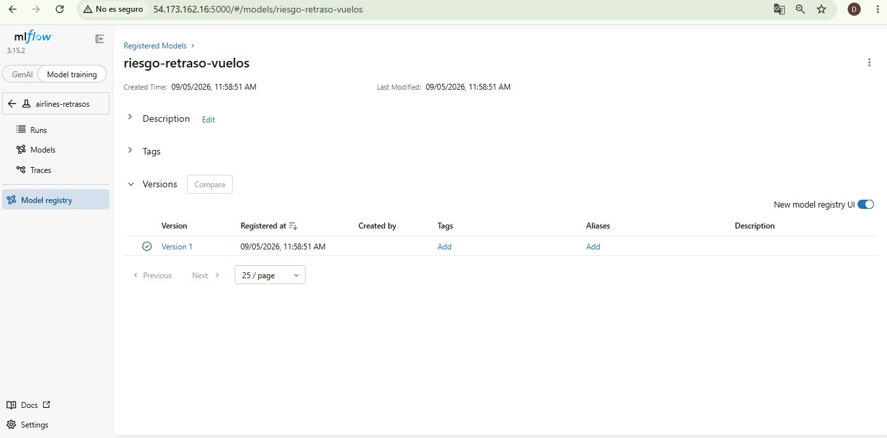
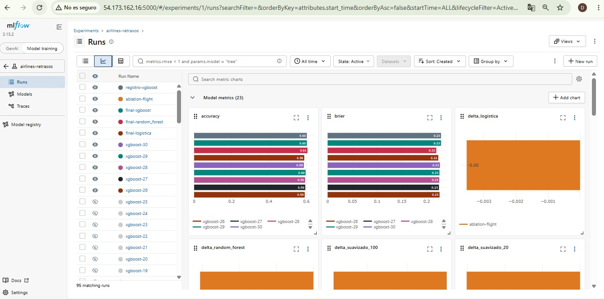

# Riesgo de retraso por franja de itinerario — Entrega 2

**Micro-proyecto · Proyecto de Desarrollo de Soluciones · MAIA · Grupo 4**

María del Pilar Munoz · Santiago Melo Medina · Katherin Rodríguez Sánchez · Edisson David Prieto

---

## 1. Resumen del problema

**Contexto.** Un retraso no afecta solo al vuelo que lo sufre: compromete la aeronave y la
tripulación para los siguientes trayectos, de modo que una demora temprana se propaga en cascada por
la red. Esa propagación se observa en los datos —la tasa de retraso crece de forma sostenida a lo
largo del día— y convierte el problema en una cuestión de **diseño de itinerario**, no solo de
reacción operativa.

**Pregunta de negocio**, replanteada a partir de la retroalimentación de la Entrega 1:

> **¿Qué combinaciones de aerolínea, ruta, día y franja horaria concentran el mayor riesgo de
> retraso, de modo que el equipo de planeación pueda reforzar recursos y ajustar márgenes de
> conexión en los itinerarios más expuestos?**

El usuario es el **equipo de planeación de red**; el momento, la construcción del itinerario
estacional, no la mañana del vuelo; la decisión, dónde asignar recursos limitados: personal en
tierra, holgura en la rotación de aeronaves y márgenes de conexión.

**Alcance.** Con aerolínea, ruta, día, hora y duración no se estima el riesgo de un vuelo concreto de
mañana, sino el de una **franja de itinerario que se repite igual todas las semanas**. De ahí que sea
una herramienta de planeación y no una alerta diaria. Quedan fuera clima, estado de la aeronave,
tráfico en tiempo real e integración con sistemas aeroportuarios.

**Datos.** *Airlines* de OpenML (id 1169), licencia ODC-PDDL, versionado con DVC. 539.383 vuelos × 8
variables, sin nulos; objetivo `Delay` binario, 44,5% positivo. Tras limpieza, 539.379 filas (se
eliminan 4 con duración cero).



*Figura 1. Tasa de retraso y volumen por aerolínea, franja horaria, día y aeropuerto de origen. El
número junto a cada barra es el volumen del grupo: es lo que separa un hallazgo accionable de una
curiosidad estadística. WN concentra a la vez la tasa más alta y el mayor volumen.*

### Cambios respecto a la Entrega 1

| Tema | Entrega 1 | Entrega 2 y por qué |
|---|---|---|
| **Encuadre** | Alerta operativa de mitigación | Herramienta de planeación: qué franjas reforzar. Los datos describen una franja semanal, no un vuelo del día. |
| **Pregunta de negocio** | Sin usuario ni decisión explícitos | Explicita quién decide, cuándo y sobre qué. |
| **Partición** | Estratificada aleatoria (§4.5) | **Temporal**. Hay deriva: la tasa pasa de 34,5% a 51,6% en 31 días, y una partición aleatoria evalúa sobre un período ya conocido. |
| **Descriptivo** | Matriz de correlación | Tasa **con volumen** por aerolínea, franja, día y aeropuerto. Cinco de siete variables son categóricas y con `Time` la relación no es lineal. |
| **`Flight`** | "Puede descartarse o codificarse" | Decidido con evidencia: se excluye tras medir la codificación por objetivo (§4). |
| **Duplicados** | Hipótesis sin verificar | Confirmados como vuelos recurrentes: 51,4% de los itinerarios repetidos tiene `Delay` contradictorio. |

**Sobre el techo del problema.** El dataset proviene de un flujo donde el orden de las filas cargaba
la marca temporal. Al perderse, se perdió la variable más predictiva: si la aeronave venía retrasada
de su vuelo anterior. Parte de esa información se recuperó —el orden permite reconstruir 31 días
consecutivos— pero el vínculo aeronave–vuelo previo no. Eso acota lo que cualquier modelo puede
lograr aquí, y la sección 4 lo demuestra empíricamente.

---

## 2. Modelos desarrollados

### 2.1 Diseño experimental

**Partición temporal**, tres bloques consecutivos y disjuntos:

| Partición | Días | Filas | Tasa de retraso |
|---|---|---|---|
| Entrenamiento | 0–19 | 347.091 | 41,00% |
| Validación | 20–24 | 84.824 | 48,14% |
| Prueba | 25–30 | 107.464 | 53,14% |

Validación fija hiperparámetros y umbral. Prueba se reserva y se toca **una sola vez**, con los tres
finalistas.

**Métricas.** El criterio de selección es **ROC-AUC**, porque mide ordenamiento y es invariante a la
tasa base: con la tasa moviéndose de 41% a 53%, cualquier métrica atada a un umbral cambia por
razones ajenas al modelo. Se acompaña de PR-AUC (se concentra en la clase positiva, que es la
accionable), **Brier y log-loss** (el tablero muestra una probabilidad, y ese número debe significar
lo que dice), precisión/recall/F1 al umbral fijado en validación, y el **tamaño del artefacto**, que
no es un detalle cuando la deriva obliga a reentrenar con frecuencia.

**Líneas base.** Reciben el mismo trato que los modelos —se ajustan en entrenamiento, fijan umbral
en validación, se reajustan sobre 0–24 y se miden en prueba—:

| Línea base | ROC-AUC | Accuracy | F1 |
|---|---|---|---|
| Clase mayoritaria | 0,5000 | 0,5314 | 0,6940 |
| Memoria de itinerario | 0,6043 | 0,5957 | 0,6603 |
| **Tasa por aerolínea × franja** | **0,6763** | 0,5946 | 0,6933 |

La tercera es la referencia real: la regla que un analista escribiría a mano en una tarde.

### 2.2 Las tres familias

| Familia | Rol | Preprocesamiento | Columnas |
|---|---|---|---|
| Regresión logística | Base interpretable | One-hot disperso + escalado | 600 |
| Random Forest | Interacciones sin especificarlas | Codificación ordinal | 13 |
| XGBoost | Boosting con categóricas nativas | dtype `category` | 13 |

Las nominales son de alta cardinalidad: 18 aerolíneas, 293 aeropuertos de origen, 293 de destino,
4.190 rutas. XGBoost con `enable_categorical` hace particiones de conjunto sobre ellas en lugar de
imponer el orden artificial de una codificación ordinal. Para la logística se excluye `Ruta` del
one-hot: sus 4.190 niveles dispararían la dimensionalidad sin aportar sobre `Airline` y los dos
aeropuertos.

### 2.3 Variables construidas

Restricción de diseño: **toda variable debe poder calcularse con los seis campos que el tablero pide
al usuario**. Una variable que dependa del día calendario concreto sería imposible de construir al
servir.

| Variable | Motivación |
|---|---|
| `Hora`, `TimeSin`, `TimeCos` | La hora es cíclica: 23:50 y 00:10 distan 20 minutos, no 23 horas. |
| `Franja` | Discretiza la propagación de retrasos a lo largo del día. |
| `Ruta` | El par origen–destino discrimina entre 19,0% y 68,0% en rutas frecuentes. |
| `DensidadOrigen`, `DensidadDestino` | Proxy de congestión: cuántos vuelos suele haber en ese aeropuerto ese día y esa hora. Se aprende como tabla de consulta en entrenamiento. |

### 2.4 Búsqueda de hiperparámetros

**90 corridas: 30 por familia**, muestreo aleatorio con semilla fija. Con seis o siete
hiperparámetros una malla exhaustiva obligaría a miles de combinaciones; 30 muestras cubren mejor el
espacio con el mismo presupuesto. Todas registradas en MLflow con parámetros, métricas de validación
y tiempo de ajuste.

---

## 3. Evaluación de los modelos

### 3.1 Búsqueda (AUC en validación)

| Familia | Corridas | Mínimo | Mediana | Máximo |
|---|---|---|---|---|
| XGBoost | 30 | 0,6862 | **0,6996** | **0,7075** |
| Random Forest | 30 | 0,6633 | 0,6992 | 0,7073 |
| Regresión logística | 30 | 0,6762 | 0,6901 | 0,6906 |



*Figura 2. Izquierda: dispersión del AUC en los 30 experimentos de cada familia — una caja alta
significa que la elección de hiperparámetros importa mucho. Derecha: costo de ajuste frente a
desempeño, que es lo que permite decidir cuando dos familias empatan en AUC.*

### 3.2 Finalistas sobre el bloque de prueba

Reajustados sobre días 0–24, evaluados una sola vez sobre 25–30.

| Familia | ROC-AUC | PR-AUC | Accuracy | Precisión | Recall | Brier | Tamaño | Ajuste |
|---|---|---|---|---|---|---|---|---|
| Random Forest | **0,6987** | 0,7312 | 0,6062 | 0,5842 | 0,8982 | **0,2195** | 75,9 MB | 125 s |
| XGBoost | 0,6974 | 0,7309 | 0,6027 | 0,5808 | 0,9072 | 0,2292 | **10,3 MB** | **5,6 s** |
| Regresión logística | 0,6857 | 0,7158 | 0,5888 | 0,5696 | 0,9257 | 0,2236 | 0,15 MB | 7,7 s |
| *Mejor línea base* | *0,6763* | — | *0,5946* | — | — | *0,2352* | — | — |

**Ganancia sobre la mejor línea base: +0,0212 de AUC.**

### 3.3 Selección

Random Forest y XGBoost quedan separados por **0,0013 de AUC** —dentro del ruido para un bloque de
107 mil filas— mientras que el artefacto de Random Forest pesa **7,4 veces más** y tarda **22 veces
más en ajustarse**: 125 segundos frente a 5,6.

Regla aplicada: gana el de mayor AUC, salvo que otro quede dentro de 0,005 de AUC y pese menos de la
mitad; en ese caso se prefiere el ligero.

**Modelo elegido: XGBoost.** No por desempeño, que es equivalente, sino por costo de despliegue en
un modelo que la deriva obliga a reentrenar con frecuencia. La diferencia de tiempo se amplía porque
XGBoost aprovecha la GPU y Random Forest no: el entrenamiento se ejecutó en Google Colab sobre una
Tesla T4. Conviene precisar que **la GPU acelera, no mejora**: el AUC de XGBoost es idéntico en CPU
y en GPU, y solo cambia el tiempo. Registrado en MLflow como
`riesgo-retraso-vuelos`, versión 1.

### 3.4 Calibración

Los tres modelos **subestiman el riesgo** en el bloque de prueba, XGBoost más que los otros:
predice 42,8% en promedio cuando la tasa real fue 53,1%. Es la consecuencia esperable de la deriva.

Se probó recalibración isotónica ajustada sobre validación:

| | ROC-AUC | Brier | Prob. media |
|---|---|---|---|
| Sin calibrar (entrenado en 0–24) | **0,6974** | 0,2292 | 0,4277 |
| Calibrado (0–19 + isotónica en 20–24) | 0,6811 | **0,2252** | 0,4968 |

**Se descartó.** Corrige el sesgo, pero cuesta **0,0163 de AUC**. El costo no viene de la
calibración sino de que este esquema obliga a entrenar con 20 días en vez de 25. La salida para la
Entrega 3 es calibración con validación cruzada sobre los días 0–24, que no sacrifica datos.

### 3.5 Punto de operación

El umbral que maximiza F1 **no sirve**: marca el 83% de las franjas con un *lift* de 1,09. Una
recomendación que señala casi todo el itinerario no ayuda a priorizar.

El criterio es un **presupuesto de refuerzo**: planeación puede reforzar una fracción acotada del
itinerario, así que el umbral se fija para marcar ese porcentaje.

| Punto de operación | Umbral | % franjas reforzadas | Precisión | Recall | Lift |
|---|---|---|---|---|---|
| Máximo F1 | 0,270 | 83,0% | 0,581 | 0,907 | 1,09 |
| Youden J | 0,420 | 45,1% | 0,683 | 0,580 | 1,29 |
| Refuerzo 30% | 0,484 | 31,2% | 0,738 | 0,434 | 1,39 |
| **Refuerzo 20%** | **0,553** | **20,9%** | **0,799** | 0,314 | **1,50** |
| Refuerzo 10% | 0,689 | 10,3% | 0,884 | 0,171 | 1,66 |



*Figura 3. Precisión dentro del grupo reforzado según qué proporción del itinerario se refuerce. La
línea roja marca la tasa base: repartir los recursos al azar.*

**Se adopta el presupuesto del 20%**: de cada 100 franjas reforzadas, **80 registran retraso**,
frente a 53 si se repartieran los recursos al azar. Los umbrales se calculan sobre los cuantiles de
las predicciones en entrenamiento, nunca sobre prueba.

---

## 4. ¿Sirve `Flight`? Un experimento controlado

La Entrega 1 dejó `Flight` sin decidir. La retroalimentación señaló que una **codificación por
objetivo** podría capturar el efecto de rotación de aeronave que el dataset perdió. La hipótesis es
razonable y se puso a prueba: se sustituye el número de vuelo por su tasa histórica de retraso,
ajustada solo en entrenamiento y suavizada hacia la media global.

**Estabilidad de la codificación entre períodos**

| | |
|---|---|
| Números de vuelo distintos | 6.543 |
| Observaciones por número de vuelo | 53 |
| **Correlación del riesgo entre entrenamiento y validación** | **0,393** |
| Riesgo medio codificado | 0,410 (entrenamiento) vs 0,481 (validación) |

**Efecto sobre el desempeño (AUC en validación)**

| Familia | Sin `Flight` | Con `Flight` | Δ |
|---|---|---|---|
| Regresión logística | 0,6906 | 0,6871 | −0,0035 |
| Random Forest | 0,7073 | 0,7012 | −0,0061 |
| XGBoost | 0,7075 | 0,7015 | −0,0060 |

**Sensibilidad al suavizado (XGBoost)**

| Suavizado | 5 | 20 | 100 | 500 |
|---|---|---|---|---|
| Δ AUC | −0,0060 | −0,0060 | −0,0057 | −0,0051 |

**Conclusión: `Flight` se mantiene fuera.** El riesgo por número de vuelo no es estable entre
períodos (r = 0,39) y arrastra la tasa base del período de entrenamiento hacia uno donde la tasa
real es mayor. El daño disminuye monótonamente a medida que se suaviza más —es decir, a medida que
la variable se convierte en una constante—, que es la firma de una variable que aporta ruido y
sesgo, no señal. El efecto de rotación de aeronave no se recupera: sobrevivió el identificador, pero
no el vínculo temporal que lo hacía informativo.

---

## 5. Observaciones y conclusiones sobre los modelos

1. **Los tres modelos superan las líneas base, por márgenes modestos.** +0,0212 de AUC sobre una
   tabla de frecuencias. Es real y consistente, pero el techo lo impone la información disponible,
   no el algoritmo: sin clima, estado de la aeronave ni retraso del vuelo precedente, buena parte de
   la varianza queda fuera de alcance. La sección 4 lo confirma empíricamente.
2. **La regresión logística ya llegó a su límite.** Sus 30 experimentos se mueven en un rango de
   0,014 de AUC y la mediana casi coincide con el máximo. No hay configuración que la salve: el
   problema tiene interacciones que un modelo lineal sobre estas variables no captura.
3. **Los dos modelos de árboles empatan en desempeño y se separan en costo.** 0,0013 de AUC de
   diferencia frente a un artefacto 7,4 veces más pesado y un ajuste 22 veces más lento. Cuando el
   desempeño empata, la decisión es de ingeniería.
4. **La deriva temporal domina el problema.** Obliga a partición temporal, hace que la clase
   mayoritaria del entrenamiento no sea la de prueba, descalibra las probabilidades y exige
   reentrenamiento periódico como parte del diseño, no como mejora opcional.
5. **La métrica de comparación y el punto de operación son decisiones separadas.** El AUC elige el
   modelo porque es invariante a la tasa base; el umbral se fija después con criterio de negocio.
   Confundirlas lleva a un sistema que marca el 83% del itinerario.
6. **Modelo en producción: XGBoost sin calibrar**, umbral 0,553. Marca el 21% de las franjas con
   79,9% de precisión, registrado en MLflow como `riesgo-retraso-vuelos` versión 1.

---

## 6. Tablero desarrollado

Aplicación **Dash** (`dashboard/app.py`) que desarrolla la maqueta de la Entrega 1. Carga el modelo
y los datos directamente; en la Entrega 3 pasará a consumirlos por API. La preparación de datos vive
en el paquete compartido `airlines_ml/`, que usan tanto el notebook como el tablero: que el modelo
reciba al servir columnas construidas de forma distinta a las del entrenamiento es la causa más
común de que un modelo empaquetado prediga distinto al desplegarse.

```bash
pip install -r dashboard/requirements.txt
python dashboard/app.py        # http://localhost:8050
```

**Ranking de franjas de itinerario** — es la respuesta directa a la pregunta de negocio y el
elemento central del tablero: una lista priorizada de combinaciones concretas de aerolínea, ruta,
día y franja, ordenadas por riesgo. Es lo que el equipo de planeación se lleva de aquí.

El riesgo lo estima **el modelo**, no la tasa observada, y la razón es de método: cada franja tiene
una mediana de **5 vuelos** en el período, de modo que su tasa observada solo puede valer 0%, 25%,
50%, 75% o 100%. Ordenar por ella produciría un ranking dominado por el azar. El modelo, entrenado
sobre las 539 mil filas, aprovecha lo que comparten franjas parecidas. La tasa observada y el
volumen quedan disponibles al pasar el cursor, para poder contrastar.

Sobre el total del itinerario, **16.948 de las 92.250 franjas superan el umbral de refuerzo**.

**Filtros interactivos** — aerolínea, ruta, día y franja horaria, combinables entre sí; recalculan
todo el panel. Cuando un filtro deja una sola categoría en una dimensión, la gráfica marginal
correspondiente se reemplaza por un aviso en lugar de mostrar una barra única que no compara nada.

**Indicadores clave** — tasa de retraso, vuelos en la selección, número de franjas de itinerario y
AUC del modelo. Los tres primeros responden a los filtros: *el conteo refleja lo que el usuario está
mirando, no el dataset completo*. Sin filtros muestra 539.379 vuelos en 92.250 franjas; al filtrar
por WN, miércoles y franja 12–18 baja a 5.972 vuelos en 758 franjas, con 82,5% de retraso.

**Gráficas con volumen** — tasa de retraso por aerolínea, franja horaria y día de la semana, **con
el número de vuelos anotado junto a cada barra**. El volumen es lo que separa un hallazgo accionable
de una curiosidad: una tasa del 70% sobre 300 vuelos no justifica reasignar recursos, y sin ese
número las dos barras se ven iguales.

**Evolución diaria de la tasa** — no estaba en la maqueta. Muestra la deriva y sombrea la ventana de
entrenamiento: le dice al usuario, sin explicárselo, que el modelo describe un período concreto y
caduca.

**Evaluar una franja de itinerario** — seis campos (aerolínea, origen, destino, día, hora,
duración). Devuelve tres cosas concretas: (1) la **probabilidad de retraso** de la franja; (2) su
**banda de riesgo** —bajo/medio/alto— derivada del presupuesto de refuerzo, con la acción asociada
(*priorizar en el plan de refuerzo* / *considerar si hay capacidad* / *no requiere refuerzo*); y
(3) la **comparación con su histórico** —su aerolínea, su ruta, su franja y la media global—, porque
un 60% significa algo muy distinto en una ruta que se retrasa el 68% de las veces que en una que se
retrasa el 19%.

Ejemplos: `DAL–HOU` de WN, miércoles 14:00 → **77%, riesgo alto, priorizar**. `LGA–BOS` de DL,
sábado 07:00 → **28%, riesgo bajo, no requiere refuerzo**.

**Coherencia con el modelo.** Las franjas que el tablero pone arriba del ranking son consistentes
con lo que mostró la exploración: el puente aéreo de Southwest desde Dallas encabeza la lista
(`WN · DAL–ABQ · Mié · 18–24`, 87,8%), y al filtrar por la franja de madrugada aparecen rutas
distintas (`CO · SFO–IAH`, 85,1%), porque el riesgo de esa franja se compone de otra manera.

---

## 7. Repositorio y soportes

**Repositorio:** https://github.com/santiagoMeloMedina/microproyecto-grupo4-pds-maia

| Entregable | Ubicación |
|---|---|
| Fuentes de los modelos | [`modeling/katherin-modelos-entrega2.ipynb`](../../modeling/katherin-modelos-entrega2.ipynb), [`airlines_ml/`](../../airlines_ml/) |
| Fuentes del tablero | [`dashboard/app.py`](../../dashboard/app.py) |
| Resultados de los 90 experimentos | [`resultados_experimentos.csv`](resultados_experimentos.csv) |
| Montaje de MLflow en EC2 | [`mlflow_ec2.md`](mlflow_ec2.md) |
| Hallazgos de exploración | [`borrador_entrega2.md`](borrador_entrega2.md) |

### Experimentos en MLflow sobre AWS EC2

El servidor de seguimiento corre en una instancia EC2 con backend SQLite. El notebook resuelve la
dirección desde `MLFLOW_TRACKING_URI` —variable de entorno o archivo `.env`—, de modo que las mismas
90 corridas se consolidan en el servidor del equipo sin cambiar una línea de código. El montaje está
documentado en [`mlflow_ec2.md`](mlflow_ec2.md).

Los experimentos quedan bajo `airlines-retrasos`, etiquetados por `familia` y `etapa`:

| Etiqueta | Contenido |
|---|---|
| `etapa=busqueda` | 90 corridas de búsqueda, con métricas de validación (días 20–24) |
| `etapa=final` | 3 finalistas reajustados sobre 0–24, con métricas de prueba (días 25–30) |
| `etapa=ablation` | Experimento sobre `Flight` (§4) |
| `etapa=registro` | Modelo seleccionado, con su artefacto y su entrada en el Model Registry |

Las evidencias de la ejecución sobre EC2 —consola de la instancia, servidor en funcionamiento,
interfaz de MLflow, comparación de corridas y modelo registrado— están en el **anexo**, al final de
este documento.

**Contribución individual:** historial de commits en `Insights → Contributors`.


---

# Anexo · Evidencias de MLflow sobre AWS EC2

Capturas de la ejecución de los 90 experimentos contra el servidor de seguimiento desplegado en la
instancia EC2. Se recogen aquí para no desplazar el contenido evaluable del reporte.



*Figura A1. Instancia EC2 con el servidor de MLflow: identificador, IP pública y estado.*



*Figura A2. Sesión en la instancia — usuario, host y servicio de MLflow activo.*



*Figura A3. UI de MLflow servida desde la IP pública de la instancia, con el experimento
`airlines-retrasos` y sus corridas.*



*Figura A4. Las 95 corridas del experimento: las 90 de la búsqueda, los tres finalistas
(`final-xgboost`, `final-random_forest`, `final-logistica`), el `ablation-flight` y el
`registro-xgboost`, con sus métricas en columnas y el modelo asociado.*



*Figura A5. Corrida `registro-xgboost`: las 15 métricas registradas y las etiquetas `familia`,
`etapa`, `seleccionado` y `calibrado` que permiten filtrar el experimento. A la derecha, el vínculo
al modelo registrado `riesgo-retraso-vuelos v1`.*



*Figura A6. El modelo en el Model Registry de MLflow. Es lo que permitirá, en la Entrega 3, que la
API resuelva el modelo por `models:/riesgo-retraso-vuelos/latest` en lugar de por una ruta en
disco.*



*Figura A7. Vista de gráficas de MLflow comparando métricas entre corridas. Los paneles
`delta_logistica`, `delta_random_forest` y `delta_suavizado_*` corresponden al experimento sobre
`Flight` de la sección 4: todos negativos, que es el resultado que llevó a descartar la variable.*

> **Pendiente:** insertar las capturas en `docs/2nd_delivery/images/` con esos nombres. El checklist
> de qué debe ser visible en cada una está en [`mlflow_ec2.md` §7](mlflow_ec2.md).
