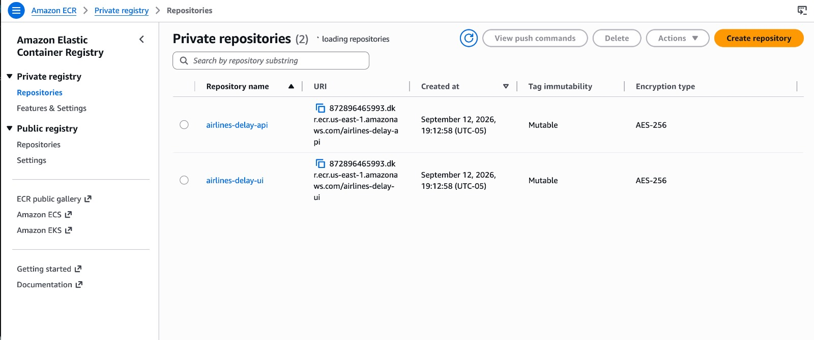
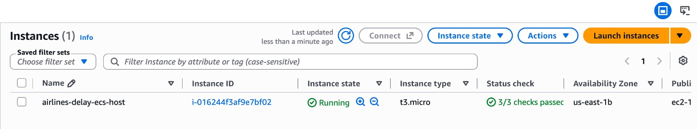
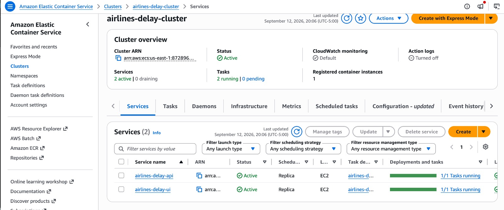
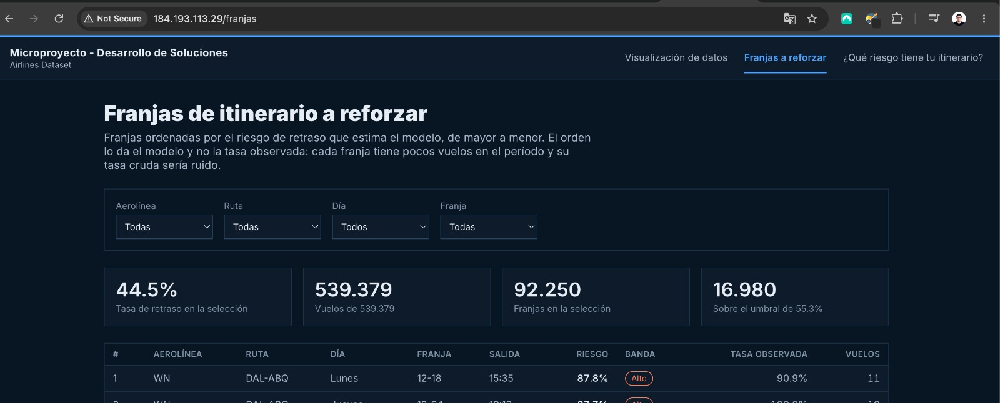
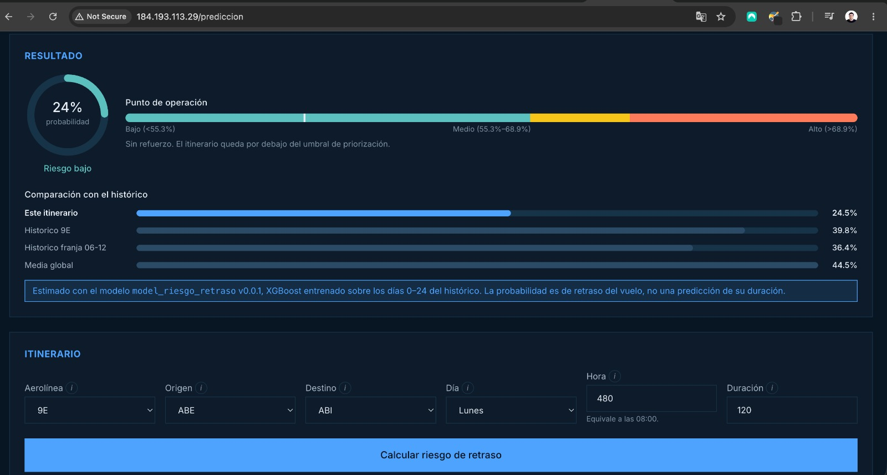

# Manual de instalación

Instalación y despliegue del tablero de riesgo de retraso y de la API que lo
alimenta. Para una validación local, Docker Compose levanta todo con un comando.
Para reproducir el despliegue de la entrega en AWS, la infraestructura como
código de `infra/` crea repositorios ECR y servicios ECS sobre una instancia
EC2 con IP elástica.

---

## 1. Requisitos

| Componente | Versión | Para qué |
|---|---|---|
| Docker Engine | 24 o superior | Despliegue con contenedores (vía recomendada) |
| Docker Compose | v2 o superior | Orquestación de los dos servicios |
| Git | cualquiera | Clonar el repositorio |

Para desplegar en AWS también se requiere:

| Componente | Versión | Para qué |
|---|---|---|
| Terraform | 1.5 o superior | Crear y actualizar la infraestructura |
| AWS CLI | 2 o superior | Autenticación, ECR y actualización de ECS |
| Cuenta o laboratorio AWS | con permisos suficientes | EC2, ECS, ECR, S3, CloudWatch y red |

Solo si se va a instalar sin Docker, o reentrenar el modelo:

| Componente | Versión | Para qué |
|---|---|---|
| Python | 3.10 – 3.12 | API y paquete del modelo |
| Node.js | 20 o superior | Compilar el tablero |
| DVC con soporte S3 | cualquiera | Descargar `data/airlines.csv`, solo para reentrenar |

---

## 2. Clonar el repositorio

```bash
git clone https://github.com/santiagoMeloMedina/microproyecto-grupo4-pds-maia.git
cd microproyecto-grupo4-pds-maia
```

No hace falta ejecutar `dvc pull`. El modelo entrenado viaja dentro del wheel en
`api/model-package/` y el histórico de vuelos está versionado en
`dashboard/data/vuelos.parquet`. El CSV original, de 19 MB, solo se necesita para
reentrenar desde cero.

---

## 3. Despliegue local con Docker Compose

```bash
docker compose up --build
```

La primera construcción tarda varios minutos: instala XGBoost y compila el
tablero. Al terminar:

| Servicio | Dirección |
|---|---|
| Tablero | http://localhost:8080 |
| API (documentación interactiva) | http://localhost:8002/docs |
| API (estado) | http://localhost:8002/api/v1/health |

Para detenerlo:

```bash
docker compose down
```

### Si el puerto 8080 está ocupado

Es frecuente en Windows. El puerto del tablero se cambia con `UI_PORT`, que
ajusta también los orígenes que la API acepta por CORS:

```bash
UI_PORT=8088 docker compose up --build
```

En PowerShell:

```powershell
$env:UI_PORT = "8088"; docker compose up --build
```

> **Importante:** no basta con cambiar el puerto publicado a mano en el
> `docker-compose.yml`. El navegador envía el encabezado `Origin` con el puerto
> desde el que se sirve el tablero, y la API compara ese valor por igualdad
> exacta. Si ambos no coinciden, la interfaz carga pero queda sin datos. Usar
> `UI_PORT` mantiene las dos cosas sincronizadas.

---

## 4. Despliegue reproducible en AWS con Terraform y ECS

Este es el procedimiento implementado en el PR #13. Terraform crea dos
repositorios ECR, un clúster ECS sobre una instancia EC2, dos servicios ECS, una
IP elástica, el grupo de seguridad y los grupos de logs en CloudWatch. El script
de despliegue construye y publica las imágenes de la API y del tablero y fuerza
la actualización de ambos servicios.

> **Alcance:** es una arquitectura académica de una sola instancia, sin
> balanceador, TLS, autenticación ni alta disponibilidad. Durante un
> redespliegue puede existir una interrupción breve.

### 4.1 Configurar AWS

1. Iniciar el laboratorio o la cuenta AWS y configurar credenciales válidas para
   AWS CLI. En AWS Academy deben renovarse cuando se reinicie la sesión:

   ```bash
   aws sts get-caller-identity
   ```

2. Identificar una VPC y una subred pública con ruta a un Internet Gateway.

3. Preparar las variables del despliegue:

   ```bash
   cd infra
   cp .env.example .env
   ```

   Editar `.env` y reemplazar `VPC_ID` y `SUBNET_ID`. El script genera un bucket
   S3 versionado para el estado de Terraform si `TF_STATE_BUCKET` no está
   definido, y guarda su nombre en este archivo local.

### 4.2 Crear la infraestructura y publicar las imágenes

Desde la raíz del repositorio:

```bash
./infra/scripts/build_and_push.sh
```

El proceso ejecuta `terraform init` y `terraform apply`, autentica Docker en ECR,
construye las imágenes para `linux/amd64`, las publica con la etiqueta `latest`
y fuerza un nuevo despliegue de los servicios. La URL pública de la API se
incorpora al tablero durante su construcción. Vite congela esta URL dentro del
bundle compilado: cambiarla exige reconstruir y publicar la imagen del tablero;
no basta con reiniciar el contenedor.

> El script acepta una etiqueta opcional, pero las tareas ECS del PR #13
> referencian `latest`. Para reproducir el despliegue sin modificar la
> infraestructura, se debe ejecutar sin argumento.



*Repositorios ECR creados para almacenar las imágenes de la API y del tablero.*



*Instancia EC2 registrada como capacidad del clúster ECS.*



*Servicios de API y tablero administrados por ECS.*

### 4.3 Verificar el despliegue

```bash
terraform -chdir=infra output ui_url
terraform -chdir=infra output api_url
```

Abrir la URL del tablero y comprobar la API con:

```bash
API_URL="$(terraform -chdir=infra output -raw api_url)"
curl "$API_URL/api/v1/health"
```



*Vista de franjas a reforzar servida desde la infraestructura AWS.*



*Vista de predicción individual conectada con la API desplegada.*

[Ver demostración en video del despliegue](media/e3_deployment_demo.mp4)

El archivo MP4 permite comprobar la navegación del sistema desplegado. GitHub
lo presenta como un recurso descargable o reproducible según el navegador.

### 4.4 Seguridad, costos y limpieza

Los puertos 80 y 8002 se abren por defecto a `0.0.0.0/0`. Esto es aceptable solo
para el laboratorio académico. En otro entorno se debe restringir
`public_ingress_cidr` en `terraform.tfvars` y añadir TLS y autenticación.

Para evitar costos al terminar, ejecutar desde la raíz del repositorio:

```bash
set -a
source infra/.env
set +a
export TF_VAR_aws_region="${AWS_REGION:-us-east-1}"
export TF_VAR_project_name="${PROJECT_NAME:-airlines-delay}"

# Reabre el backend correcto incluso desde un clon nuevo o si se eliminó .terraform/.
terraform -chdir=infra init -input=false -reconfigure \
   -backend-config="bucket=$TF_STATE_BUCKET" \
   -backend-config="key=${TF_STATE_PREFIX:-${PROJECT_NAME:-airlines-delay}}/terraform.tfstate" \
   -backend-config="region=${AWS_REGION:-us-east-1}"

terraform -chdir=infra destroy \
   -var="vpc_id=$VPC_ID" \
   -var="subnet_id=$SUBNET_ID"
```

El bucket S3 que conserva el estado se administra fuera de Terraform. Después
de confirmar la destrucción, puede vaciarse y eliminarse manualmente si ya no se
utilizará.

---

## 5. Despliegue manual alternativo en una instancia EC2

1. Lanzar una instancia con Ubuntu 24.04. Se recomienda **t3.small** o superior
   con 20 GB de disco; la API carga el modelo y el histórico en memoria.

2. Abrir en el grupo de seguridad los puertos **8002** (API) y **8080** (tablero).
   Para una prueba académica temporal puede usarse *Anywhere IPv4*; fuera del
   laboratorio se deben restringir a las direcciones consumidoras.

3. Conectarse e instalar Docker:

   ```bash
   ssh -i llave.pem ubuntu@IP_PUBLICA

   sudo apt update
   sudo apt install -y docker.io docker-compose-v2 git
   sudo usermod -aG docker ubuntu
   newgrp docker
   ```

4. Clonar y levantar, indicando la IP pública para que el tablero sepa dónde
   está la API. Antes de levantar, editar `docker-compose.yml` y reemplazar el
   valor completo de `BACKEND_CORS_ORIGINS` por
   `'["http://IP_PUBLICA:8080"]'`. Si se elige otro `UI_PORT`, se debe usar ese
   mismo puerto en el origen permitido. `PUBLIC_HOST` configura la URL que usa
   el tablero, pero no amplía por sí solo los orígenes aceptados por la API:

   ```bash
   git clone https://github.com/santiagoMeloMedina/microproyecto-grupo4-pds-maia.git
   cd microproyecto-grupo4-pds-maia

   nano docker-compose.yml
   # En services.api.environment, dejar:
   # BACKEND_CORS_ORIGINS: '["http://IP_PUBLICA:8080"]'

   PUBLIC_HOST=http://IP_PUBLICA:8002 docker compose up --build -d
   ```

   `PUBLIC_HOST` y el origen público en `BACKEND_CORS_ORIGINS` son obligatorios
   en este despliegue alternativo. Vite congela la URL de la API dentro del
   bundle durante la construcción y el navegador exige que su origen esté
   permitido por CORS.

5. Verificar:

   ```bash
   curl http://IP_PUBLICA:8002/api/v1/health
   ```

   El tablero queda en `http://IP_PUBLICA:8080`.

---

## 6. Instalación local sin Docker

Útil para desarrollar. Requiere dos terminales.

### API

```bash
cd api
pip install tox
tox run -e run
```

`tox` crea su propio entorno virtual, instala el paquete del modelo desde el
wheel y levanta uvicorn en el puerto 8002.

### Tablero

```bash
cd ui
cp .env.example .env.local
npm ci
npm run dev
```

Queda en http://localhost:5173, que ya está entre los orígenes que la API acepta
por defecto.

---

## 7. Reentrenar el modelo

Solo si se quiere regenerar el artefacto. Requiere el CSV original.

```bash
dvc pull                    # descarga data/airlines.csv (19 MB)
python -m pip install tox build pyarrow

cd model-pkg
tox run -e test_package     # entrena y corre las pruebas
python -m build             # genera dist/*.whl

cp dist/model_riesgo_retraso-0.0.1-py3-none-any.whl ../api/model-package/
cd ..
python -m pip install --force-reinstall model-pkg/dist/*.whl
```

El nombre `0.0.1` debe coincidir con la versión declarada por el paquete y con
la ruta fijada en `api/requirements.txt`. Si se incrementa la versión, se deben
actualizar ambos nombres antes de reconstruir la imagen de la API.

El entrenamiento toma alrededor de un minuto en CPU. Para usar GPU en Colab,
exportar `XGBOOST_DEVICE=cuda`; acelera el ajuste pero no cambia el resultado.

Si cambia el histórico, regenerar también el parquet del tablero:

```bash
python scripts/generar_datos_tablero.py
```

---

## 8. Verificar la instalación

```bash
(cd api && tox run -e test_app)             # pruebas de la API
(cd model-pkg && tox run -e test_package)   # pruebas del modelo
```

Las pruebas del paquete incluyen una compuerta de desempeño: fallan si el
ROC-AUC del modelo cae por debajo de la línea base del proyecto (0,6763). El
valor puede variar en las últimas cifras decimales entre plataformas; en la
reproducción documentada se obtuvo 0,6972 frente al 0,6974 registrado por el
artefacto desplegado.

---

## 9. Problemas frecuentes

| Síntoma | Causa | Solución |
|---|---|---|
| El tablero carga pero todo aparece vacío | El origen del tablero no coincide con el que acepta la API | Levantar con `UI_PORT`, o revisar `BACKEND_CORS_ORIGINS` |
| `Bind for 0.0.0.0:8080 failed: port is already allocated` | Otro servicio usa el 8080 | `UI_PORT=8088 docker compose up` |
| El tablero busca la API en `localhost` desde otra máquina | Se construyó sin `PUBLIC_HOST` | Reconstruir con `PUBLIC_HOST=http://IP:8002 docker compose build ui` |
| `libgomp.so.1: cannot open shared object file` | Falta la librería de OpenMP que usa XGBoost | Ya resuelto en el `Dockerfile`; en instalación manual, `sudo apt install libgomp1` |
| `No se encontro .../data/airlines.csv` | Solo ocurre al reentrenar | `dvc pull`, o definir `AIRLINES_CSV` |
| Recargar `/franjas` da 404 | Falta el `try_files` de nginx | Ya resuelto en `ui/nginx.conf`; ocurre si se sirve `dist/` con otro servidor |
| La primera consulta tarda varios segundos | La API puntúa las 92.250 franjas al arrancar | Es esperado y ocurre una sola vez por proceso |
| AWS CLI devuelve credenciales vencidas | Terminó la sesión de AWS Academy | Reiniciar el laboratorio y volver a configurar las credenciales |
| ECS no inicia las tareas | La imagen aún no existe en ECR o la instancia no tiene memoria | Ejecutar de nuevo `build_and_push.sh` y revisar los logs en CloudWatch |
