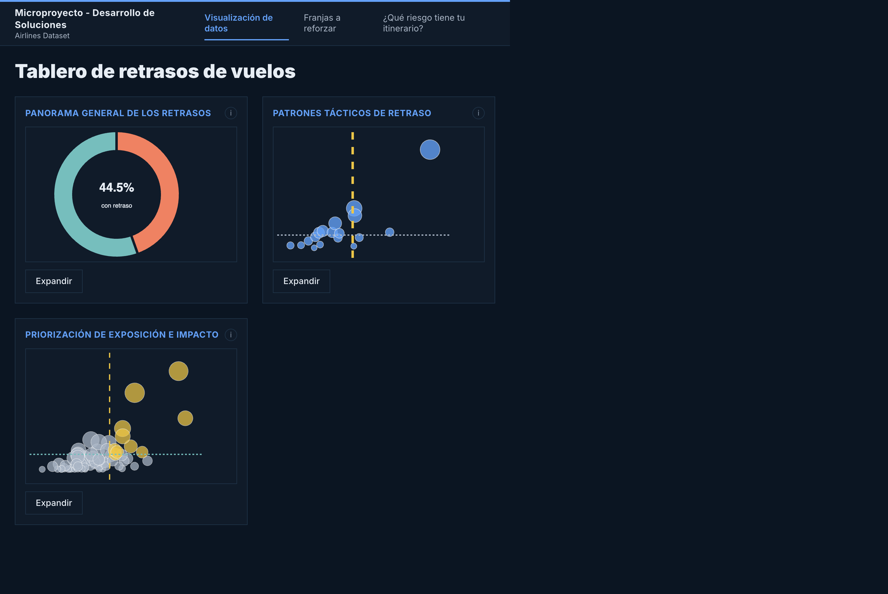
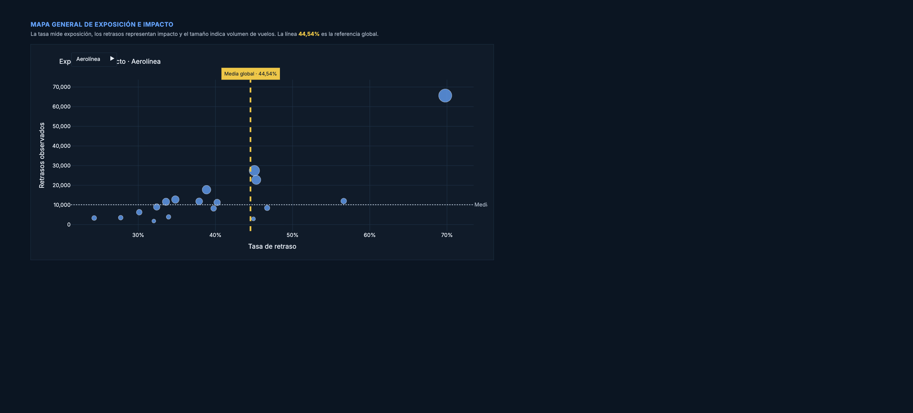
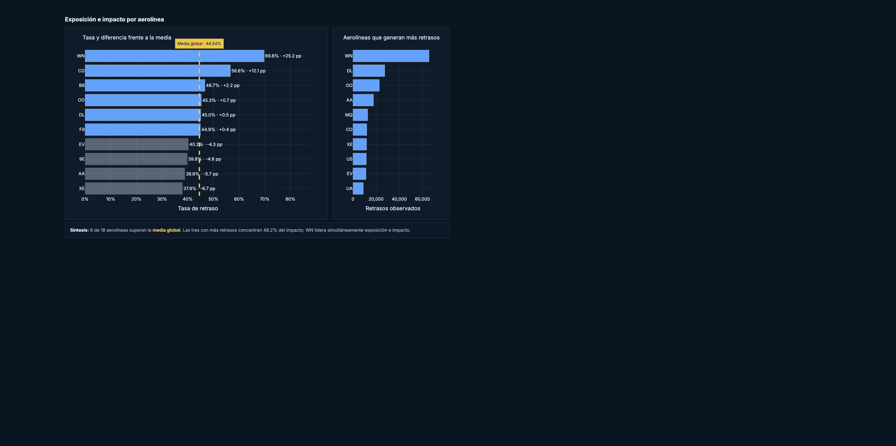
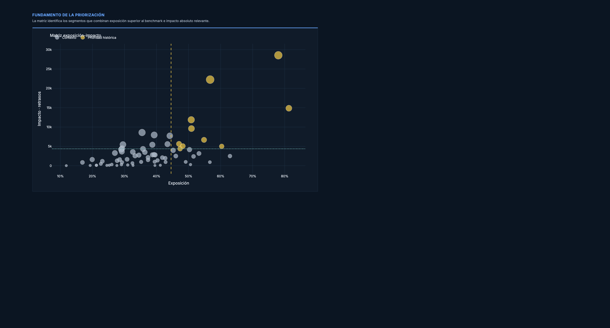
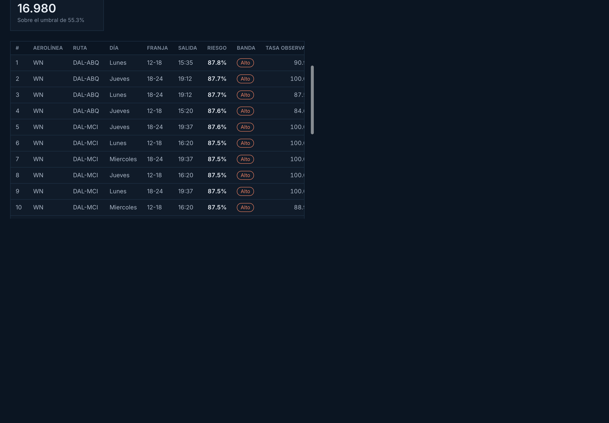
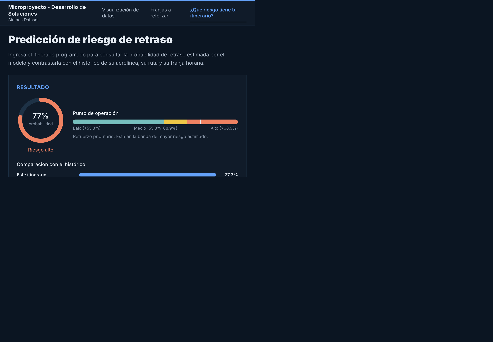

# Manual de usuario del tablero

Tablero de planeación de riesgo de retraso. Está pensado para quien programa el
itinerario y necesita decidir **dónde concentrar recursos de refuerzo la próxima
semana**, no para consultar el estado de un vuelo en curso.

Para instalarlo, ver el [manual de instalación](manual_instalacion.md). Una vez
levantado con Docker Compose, el tablero está en `http://localhost:8080` (o el
puerto configurado). En AWS se abre la dirección `ui_url` informada por
Terraform.

## Acceso al despliegue

El prototipo de la entrega se verificó en las siguientes direcciones:

- **Tablero:** http://184.193.113.29
- **Estado de la API:** http://184.193.113.29:8002/api/v1/health
- **Documentación interactiva de la API:** http://184.193.113.29:8002/docs

El acceso fue verificado el **12 de septiembre de 2026**: el tablero respondió
correctamente y la API reportó la versión `0.1.0`, con el modelo XGBoost
`0.0.1`. Estas URL son evidencia histórica, no un servicio permanente: la
dirección pertenece a un entorno de AWS Academy y puede dejar de responder
cuando finalice la sesión del laboratorio. Esto no afecta la instalación local
ni la reproducción con Terraform descritas en el manual de instalación.

*Interfaz inicial con la navegación principal y las tres tarjetas de análisis
descriptivo.*

---

## Qué responde y qué no

El tablero estima la **probabilidad de que un vuelo se retrase**, a partir de seis
datos del itinerario programado: aerolínea, origen, destino, día de la semana,
hora de salida y duración.

No estima cuántos minutos durará el retraso, no usa información del día de la
operación —clima, estado de la aeronave, retraso del vuelo anterior—, y no
predice un vuelo concreto ya despegado. Es una herramienta de planeación
anticipada.

---

## Las tres secciones

La barra superior tiene tres pestañas.

### 1. Visualización de datos

Panorama descriptivo del histórico, en tres tableros que se abren al hacer clic
sobre cada tarjeta:

- **Panorama general de los retrasos** — dimensión del problema en el período
  analizado.
- **Patrones tácticos de retraso** — concentración por operador, horario y
  ubicación.
- **Priorización de exposición e impacto** — segmentos que merecen atención por
  su tasa y su volumen.

Son vistas **descriptivas**: resumen lo que ocurrió, no estiman riesgo futuro ni
el efecto de una intervención. Sirven para entender el terreno antes de decidir.

#### Panorama general de los retrasos

*Tasa global de retraso y contexto del indicador para el período analizado.*

*Resumen estratégico con el total de vuelos analizados y la separación entre
vuelos con retraso y sin retraso.*

#### Patrones tácticos de retraso

*Mapa general de exposición e impacto por aerolínea. La gráfica conserva el
título, la referencia global y las escalas completas de ambos ejes.*

*Comparación de la tasa de retraso frente a la media global y de las aerolíneas
que generan el mayor volumen de retrasos observados.*

#### Priorización de exposición e impacto

*Matriz completa de priorización, con los ejes de exposición e impacto, las
referencias del análisis y los segmentos de prioridad histórica.*

### 2. Franjas a reforzar

Es la sección que responde la pregunta de negocio. Lista las **franjas de
itinerario** —la combinación de aerolínea, ruta, día de la semana y franja
horaria— ordenadas por el riesgo que estima el modelo, de mayor a menor.

**Filtros.** Los cuatro selectores de la parte superior (aerolínea, ruta, día y
franja) se combinan entre sí. Se limpian todos con el botón *Limpiar filtros*,
que aparece solo cuando hay alguno activo.

**Indicadores.** Responden siempre a la selección activa, no al total:

| Indicador | Qué significa |
|---|---|
| Tasa de retraso en la selección | Proporción histórica de vuelos retrasados entre los que cumplen los filtros |
| Vuelos | Cuántos vuelos quedan en la selección, sobre el total del período |
| Franjas en la selección | Cuántas franjas distintas cubre la selección |
| Sobre el umbral | Cuántas de esas franjas superan el umbral de priorización |

*Vista desplegada de las franjas, con filtros e indicadores calculados sobre la
selección activa.*

**La tabla.** Cada fila es una franja. Las columnas que más importan:

- **Riesgo** — la probabilidad que estima el modelo. Es lo que ordena la tabla.
- **Banda** — la acción sugerida: *alto* (refuerzo prioritario), *medio*
  (refuerzo recomendado), *bajo* (sin refuerzo).
- **Tasa observada** — qué proporción de esos vuelos se retrasó históricamente.
- **Vuelos** — cuántos vuelos respaldan esa tasa observada.

> **Por qué el orden lo da el modelo y no la tasa observada.** Muchas franjas
> tienen menos de una docena de vuelos en el período. Una franja con cuatro
> vuelos y cuatro retrasos muestra una tasa observada del 100%, pero eso es
> ruido, no evidencia. El modelo comparte información entre franjas parecidas y
> produce una estimación más estable. La columna *Vuelos* permite juzgar cuánto
> respaldo tiene la tasa observada de cada fila.

### 3. ¿Qué riesgo tiene tu itinerario?

Evalúa un itinerario puntual que el usuario describe.

**Formulario.** Los seis campos:

| Campo | Cómo se llena |
|---|---|
| Aerolínea | Código de dos letras, por ejemplo `WN` |
| Origen / Destino | Códigos IATA de aeropuerto. No pueden ser iguales |
| Día | Día de la semana programado |
| Hora | Minutos desde medianoche, de 0 a 1439. Debajo del campo se muestra la hora equivalente |
| Duración | Duración programada del vuelo, en minutos |

Las listas se llenan con los valores que existen en el histórico. Cada campo
tiene un ícono de ayuda con su explicación.

Al pulsar **Calcular riesgo de retraso** la consulta va al modelo y el resultado
aparece en el panel **Resultado**. En pantallas de escritorio ese panel se
muestra antes del formulario; en pantallas estrechas los elementos se acomodan
verticalmente.

**El resultado** tiene tres partes:

*Probabilidad y banda.* El indicador circular muestra la probabilidad estimada y
la banda en la que cae.

*Punto de operación.* La barra ubica la probabilidad frente a los dos cortes que
separan las bandas, y debajo aparece la acción de planeación que corresponde.

> **Por qué los cortes no son números redondos.** Están en 55,3% y 68,9% porque
> salen de un **presupuesto de refuerzo del 20% del itinerario**: el umbral se
> fijó para que el sistema marque aproximadamente esa proporción de las franjas,
> que es lo que planeación puede reforzar de forma realista. Con ese corte, de
> cada 100 franjas marcadas unas 80 registran retraso, frente a 53 si los
> recursos se repartieran al azar. Un umbral que maximizara la métrica estadística
> habría marcado el 83% del itinerario, que no prioriza nada.

*Comparación con el histórico.* Contrasta la estimación contra las tasas
históricas de la aerolínea, la ruta, la franja horaria y la media global. Es lo
que permite juzgar si el número es alto o bajo: una probabilidad del 55% significa
cosas distintas en una aerolínea cuyo histórico es 70% y en una cuyo histórico es
30%.

*Ejemplo verificado en el despliegue: WN, ruta DAL–HOU, lunes a las 15:00 y 60
minutos de duración. El modelo estimó 77,3% y lo clasificó como riesgo alto. El
valor ilustra el funcionamiento del tablero y puede cambiar si se sustituye o
reentrena el modelo.*

---

## Cómo leer una probabilidad

La cifra es la **probabilidad de que el vuelo se retrase**, no un puntaje de
severidad. Un 60% quiere decir que, entre itinerarios con esas características,
históricamente se retrasaron alrededor de 6 de cada 10.

El modelo tiende a **subestimar el riesgo** en períodos de mayor congestión que
el de entrenamiento: predice en promedio 42,8% cuando la tasa real del último
bloque fue 53,1%. Esto es consecuencia de que la tasa de retraso sube a lo largo
del período analizado. Conviene usar las probabilidades para **ordenar y
priorizar**, que es para lo que el modelo es confiable, más que como un
pronóstico absoluto de frecuencia.

---

## Limitaciones

- **No hay información del día de operación.** Sin clima ni estado de la
  aeronave, el modelo alcanza un ROC-AUC de 0,697 frente a 0,676 de una simple
  tabla de frecuencias por aerolínea y franja. La ganancia es real pero modesta,
  y el techo lo impone la información disponible, no el algoritmo.
- **El período es de 31 días consecutivos** y la tasa de retraso sube del 41% al
  53% entre el inicio y el final. Un modelo entrenado con estos datos debe
  reentrenarse con regularidad.
- **Una aerolínea o un aeropuerto que no estuvieran en el histórico** no rompen la
  consulta, pero el resultado se acerca a la media global porque el modelo no
  tiene información propia sobre ellos.
- **El número de vuelo no se usa.** Se probó y se descartó: su codificación no es
  estable entre períodos y deterioraba el desempeño.

---

## Si el tablero no muestra datos

Si la interfaz carga pero las secciones aparecen vacías o con un mensaje de error,
lo más probable es que la API no esté disponible o que el navegador esté
bloqueando las consultas. En una instalación local, verificar que
`http://localhost:8002/api/v1/health` responda. En AWS, verificar el endpoint
`api_url/api/v1/health` informado por Terraform; la IP histórica de la entrega
puede haber expirado con la sesión del laboratorio.

Una respuesta correcta muestra, entre otros datos, `apiVersion`, `modelVersion`,
`modelFamily`, `threshold` y `highBandThreshold`. Si el endpoint no responde, el
problema está en la API o en el acceso de red; si responde pero el tablero sigue
vacío, revisar la configuración de CORS y la sección de problemas frecuentes del
[manual de instalación](manual_instalacion.md).
